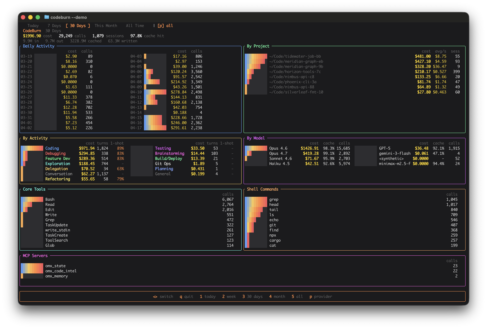

<h1 align="center">codeburn-rs</h1>

<p align="center">See where your AI coding tokens go — <b>600× faster</b></p>

<p align="center">
  
</p>

A Rust rewrite of [codeburn](https://github.com/AgentSeal/codeburn). Supports Claude, Codex, Opencode, Pi, and Copilot.

## Benchmarks

Measured with hyperfine on a MacBook Pro (M1 Pro, 16GB, 1TB) against `npx codeburn`.

| Scenario        | `cburn` | `npx codeburn` | Speedup |
| --------------- | ------- | -------------- | ------- |
| Cached output   | 6.0 ms  | N/A            | ~610×   |
| Cached sources  | 10.9 ms | 3.66 s         | ~335×   |
| Cold (no cache) | 76 ms   | 7.71 s         | ~101×   |

## Install

**Homebrew**

```sh
brew install rossnoah/tap/cburn
```

## Usage

Launch the interactive dashboard:

```sh
cburn
```

**Shell installer**

```sh
curl --proto '=https' --tlsv1.2 -LsSf https://github.com/rossnoah/codeburn-rs/releases/latest/download/cburn-installer.sh | sh
```

**Install from source**

```sh
cargo install --git https://github.com/rossnoah/codeburn-rs
```

Other commands:

```sh
cburn today                     # jump to today's usage
cburn month                     # jump to this month's usage
cburn report --period 30days    # report over a custom period
cburn report --provider claude  # filter to a single provider
cburn status                    # compact snapshot (today + week + month)
cburn export --format csv       # export usage data (csv or json)
cburn currency GBP              # change display currency
```

Run `cburn --help` or `cburn <subcommand> --help` for full options.

The binary is named `cburn` to avoid colliding with the npm `codeburn` package. If you don't have the npm version installed and prefer the full name, add an alias to your shell config:

```sh
echo 'alias codeburn=cburn' >> ~/.zshrc # update profile
alias codeburn=cburn # update current shell
```

or

```sh
echo 'alias codeburn=cburn' >> ~/.bashrc # update profile
alias codeburn=cburn # update current shell
```

## Notes

> **Cursor support is currently disabled.** Cursor stopped writing per-call token counts to its local `state.vscdb` in early 2026, so parsing that DB now reports $0 regardless of actual usage. The parser code is retained in case the data layout is restored upstream.
